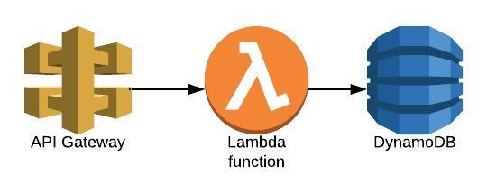

[](https://circleci.com/gh/teohrt/cruddyAPI)
[](https://opensource.org/licenses/MPL-2.0)

# cruddyAPI


This RESTful CRUD API will manage your profile data on AWS at any scale. Just hit deploy and your new microservice will be up and running!

[API Gateway](https://aws.amazon.com/api-gateway/) routes requests, [Lambda](https://aws.amazon.com/lambda/) handles the corresponding logic and your profile data gets stored in [DynamoDB](https://aws.amazon.com/dynamodb/). Should you like to take a deeper look, logs are stored in [CloudWatch](https://aws.amazon.com/cloudwatch/) and [X-Ray](https://aws.amazon.com/xray/) handles the distributed tracing, both of which conveniently make this microservice's internals available to you in dashboards.

## Routes
* [Create profile](docs/createProfileContract.md)
    * `POST api/v1/profiles`
* [Read / retrieve profile](docs/getProfileContract.md)
    * `GET api/v1/profiles/{id}`
* [Update profile](docs/updateProfileContract.md)
    * `PUT api/v1/profiles/{id}`
* [Delete profile](docs/deleteProfileContract.md)
    * `DELETE api/v1/profiles/{id}`
* [Health](docs/healthContract.md)
    * `GET api/v1/health`

## Requirements
### Deployment Requirements
* [Golang](https://golang.org/dl/) >= 1.11
* [Terraform](https://www.terraform.io/downloads.html) >= 0.12.8
* [AWS CLI](https://docs.aws.amazon.com/cli/latest/userguide/install-macos.html#awscli-install-osx-pip) >= 1.16.230
    * Infrastructure costs fit comfortably within AWS' Free-Tier with typical development usage
### Local Development Requirements
* All of the above
* [Docker](https://docs.docker.com/v17.12/install/)
* [DynamoDB-local Docker Image](https://hub.docker.com/r/amazon/dynamodb-local/)

## Usage
### Deployment
```bash
git clone https://github.com/teohrt/cruddyAPI.git
cd cruddyAPI
go mod download
make deploy
```

### Local Development
This requires two terminals. One to run the local db, and one to run the API server.
To Set up the local db, run the command
```bash
make db-start
```

Now, initialize the db table in another terminal and start the API server with these commands:
* This app listens to API Gateway requests by default. For local development you will need to make it accessible to normal http requests. Do this by commenting line 37 and uncomment lines 17 and 35 in file "app/app.go". 
```bash
make db-table-init
make run-locally
```
### Delete Infrastructure
```bash
make destroy
```
## Licence
See LICENSE.
